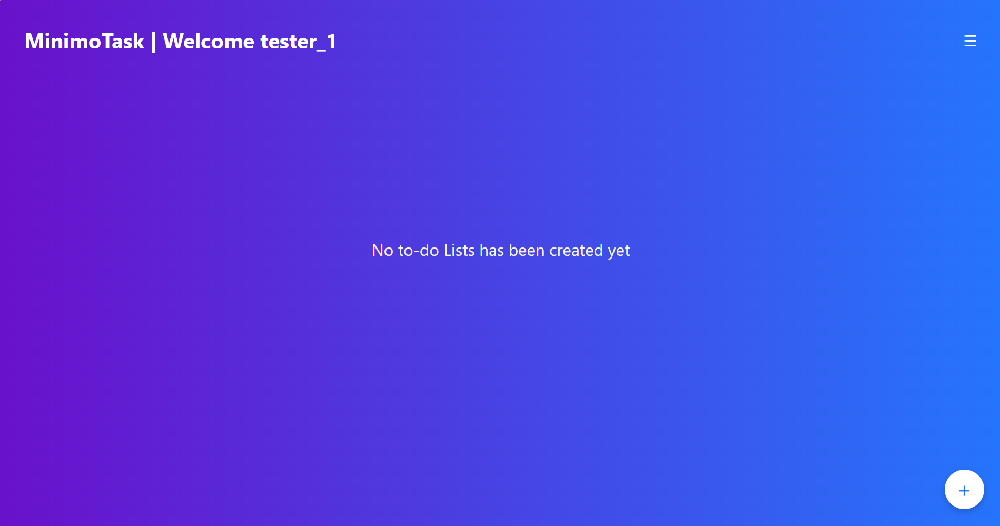
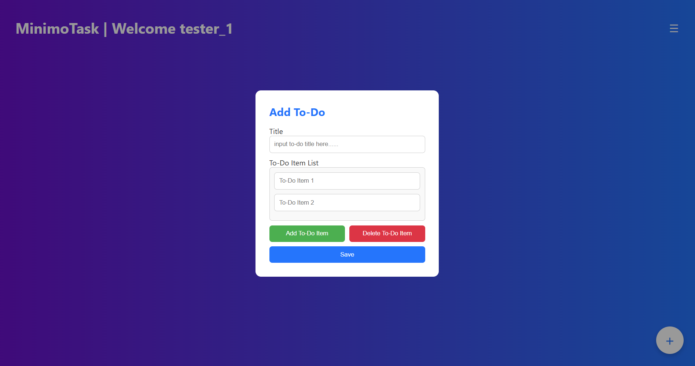
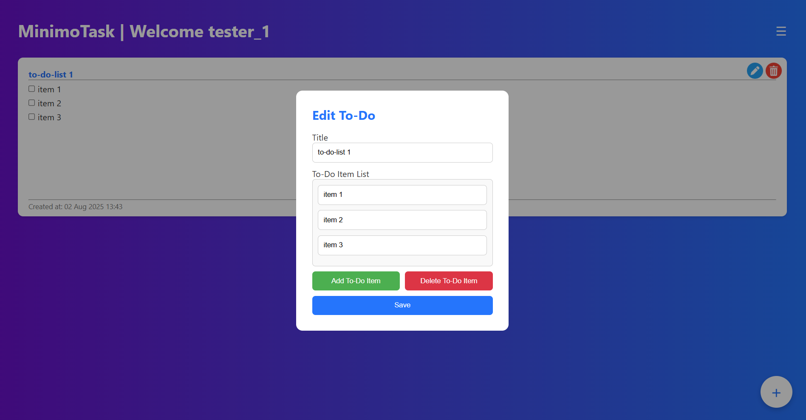
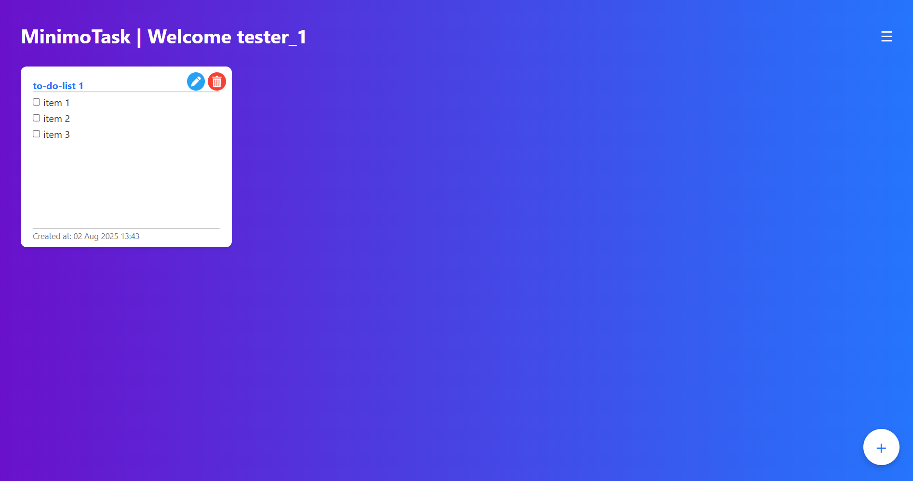
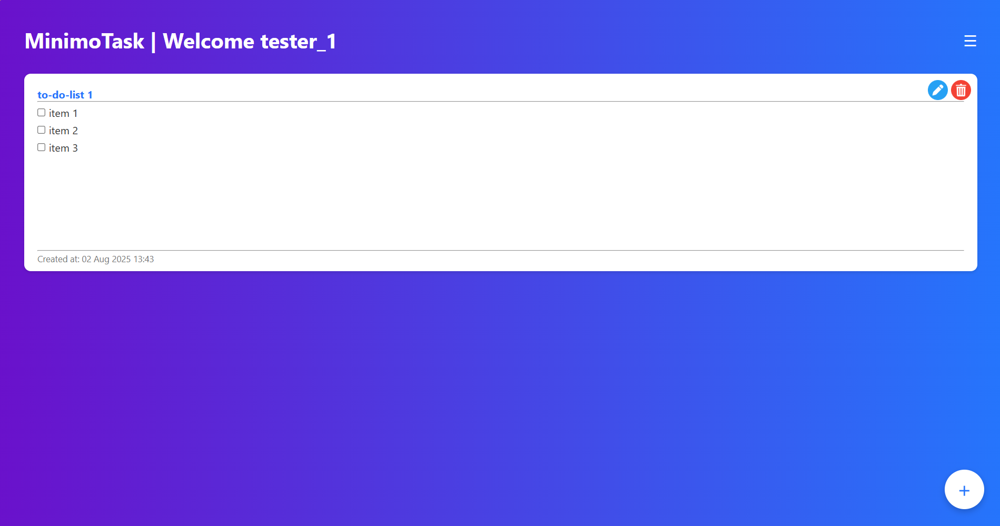

# 📝 MinimoTask – Web-Based Laravel To-Do App

MinimoTask is a **responsive web-based To-Do List application** built with Laravel. It allows users to efficiently create, update, and manage daily tasks. You can switch between **grid** and **list** views to suit your personal organization style — all through your browser.

---

## 🔑 Features

- ✅ Create new to-do items  
- ✏️ Edit existing tasks  
- ❌ Delete unwanted tasks  
- 🧱 Grid and List view modes  
- 📱 Fully responsive for desktop and mobile  

---

## 📸 Feature Demos

| Feature | Screenshot |
|--------|------------|
| 🏠 Home Page When To-Do Empty | 
| ✅ Create a new To-Do |  |
| ✏️ Edit a To-Do |  |
| 🧱 Grid View |  |
| 📋 List View |  |

> 🗂 Save all screenshots under a `screenshots/` folder inside the project root to match these paths.

---

